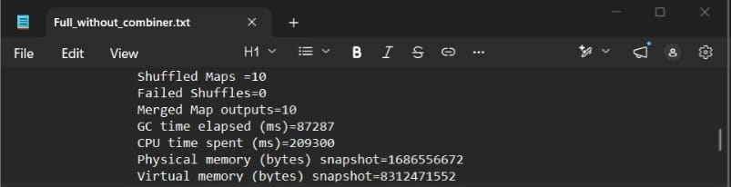
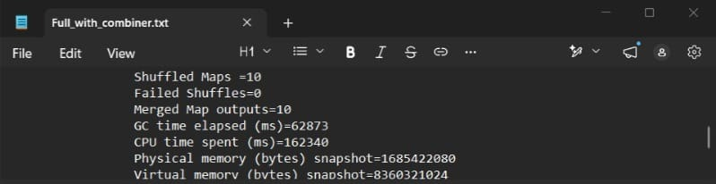
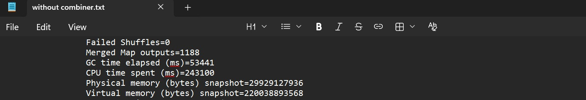
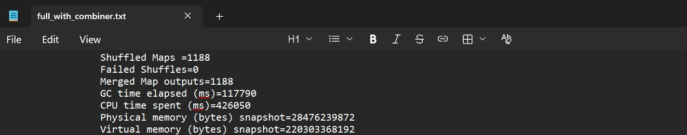

# **Big Data MapReduce Project**

## **Introduction**
This project was developed for the **Big Data** course at **Helwan National University**.   
_This is a team project. Refer to [Credits](#credits)._

## **For Cluster Run**

### 1. Clone the repository
```bash
git clone https://github.com/aliabdou92019/big-data-project.git
cd big-data-project
```

### 2. Prepare HDFS
Ensure your Hadoop cluster is running and the input/lookup files are uploaded to HDFS:
```bash
hdfs dfs -mkdir -p /user/cloudera/Root/big-data-project/task3/input/real/
hdfs dfs -put data/samples/task3_sample.txt /user/cloudera/Root/big-data-project/task3/input/real/
```

### 3. Run the Jobs
Use the provided shell scripts in the `scripts/` directory to compile and run the tasks:
```bash
./scripts/run_task3_withCombiner.sh
./scripts/run_task11.sh
```

---

##  **Problem Definition**
The objective of this project is to process and analyze massive datasets (server logs and employee records) using the **Hadoop MapReduce** framework. The solution is highly scalable to handle files exceeding **1 GB** in size, utilizing advanced Hadoop optimizations to minimize network overhead and maximize processing speed.

---


## **Task 3: URL Categorization**

**Objective:** Analyze web server access logs to categorize traffic, counting total requests, calculating average response times, and tracking error rates per category using an in-memory lookup table.

### **Technical Approach & Implementation Details**
- **Mapper Logic & Data Validation:** 
  - Extracts the URL and Response Time from raw CSV logs. 
  - Implements robust error handling by validating array bounds `if (parts.length < 7)` and skipping headers to avoid `NumberFormatException`.
  - Uses a custom `parseCsvLine` function to safely parse logs containing internal commas (e.g., URLs wrapped in quotes).
  - Skips malformed lines safely using `try/catch` and `return;` without crashing.
- **Reducer Logic:** Receives pre-aggregated strings from the Combiner, finalizes the global sum, and divides `Total Response Time / Total Requests` to compute the average.
- **Driver Class Configuration:** Configures input/output paths dynamically. It passes the lookup file path via the Configuration object (`conf.set`) so the Mappers can cache it in-memory during `setup()` (Map-Side Join).
- **Combiner Class Usage:** The aggregation logic (summing request counts, response times, and errors) is associative and commutative. `Task3Combiner` pre-aggregates these totals locally on the map nodes, drastically reducing the volume of data shuffled across the network.

### **Combiner Performance Comparison (Task 3)**

Here is the comparison showing the execution and data shuffle difference between running the job **with** the Combiner versus **without** the Combiner:



**CPU time spent(ms)**: **209300** ~= **3.5 min** 



**CPU time spent(ms)**: **162340** ~= **2.7 min** 
### Conclusion
**The job performed faster with the Combiner.**   

------

## **Task 11: Department Salary Analysis**

**Objective:** Process employee data to compute total salaries, average salaries, and employee counts grouped by department.

### **Data Collection & Preprocessing**
The dataset used for this task was synthesized by merging **12 months of raw data** into a single massive dataset to simulate real-world Big Data volumes. Prior to processing, the raw data underwent a **preprocessing** phase where it was filtered to retain only the critical columns needed for our analysis. This optimization reduces noise, shrinks the file size footprint, and significantly improves the I/O throughput of the MapReduce job.

### **Technical Approach & Implementation Details**
- **Custom Writable/WritableComparable:** Standard Hadoop types were insufficient because we needed to pass paired data (Salary and Employee Count). We implemented `DepartmentWritable` to securely serialize this object over the network. It includes a custom `compareTo` method (sorting by salary, then employees) to satisfy Hadoop's Shuffle & Sort phase.
- **Mapper Logic & Data Validation:** 
  - Extracts the department and salary from delimited logs.
  - Validates fields and skips blank or malformed lines `if (salary <= 0)` without failing the job.
- **Custom Partitioner:** Registered `DepartmentPartitioner.class` to securely route keys. It uses `(hash & Integer.MAX_VALUE) % numPartitions` to prevent negative index errors and uniformly distribute the load across multiple Reducers.
- **Reducer Logic:** Receives `DepartmentWritable` objects, aggregates the global totals, and computes the average salary per department.
- **Combiner Class Usage:** Implements `DepartmentCombiner` to locally aggregate salaries and employee counts before sending the custom objects across the network.
- **Driver Class Configuration:** Submits the job and configures num of reducers using `setNumReduceTasks(n)`.

### **Combiner Performance Comparison (Task 11)**

Here is the comparison showing the execution and data shuffle difference between running the job **with** the Combiner versus **without** the Combiner:




**CPU time spent(ms)**: **243100** ~= **4 min** 



**CPU time spent(ms)**: **199730** ~= **3.3 min** 

### Conclusion
**The job performed faster with the Combiner.**   

------

## **Credits**
[**`Ali Abdou`**](https://www.linkedin.com/in/ali-abdouu/)  
[**`Yousef Medhat`**](https://www.linkedin.com/in/yousef-medhat-7293232a1/)  
[**`Yousef Waheed`**](https://www.linkedin.com/in/youssef-waheed-8462061a7/)  
[**`Maria Gerges`**](https://www.linkedin.com/in/maria-gerges-81b04a30a/)  
[**`Amira Azzam`**](https://www.linkedin.com/in/amira-azzam2510/)  
[**`Amr Yasser`**](https://www.linkedin.com/in/amryb/)

## **License**
This project is open source and available under the [MIT License](https://mit-license.org/).
